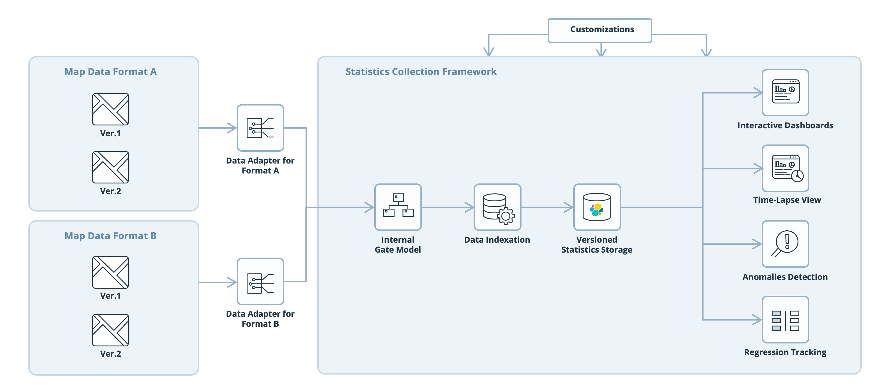

# Statistic Framework

## 📌 Overview

The **Statistic Framework** is a comprehensive geospatial data platform designed to collect, process, and analyze spatial features. 
It provides a robust infrastructure for handling various types of geospatial data, generating statistics, and visualizing changes over time.

This framework processes the following types of geo-spatial features:
- Point/Multi-Point features
- Line/Multi-Line features
- Polygon/Multi-Polygon features
- GeometryCollection features

## 🎯 Project Purpose

The Statistic Framework enables organizations to:

- Store and manage GeoJSON-compliant spatial features
- Enrich geospatial data through preprocessing (calculating metrics like length, area, etc.)
- Run advanced analytical jobs to compare versions, calculate changes, and merge complex geometries
- Generate dashboard-ready outputs for monitoring and visualization of spatial data changes
- Process large volumes of geospatial data using distributed computing (Apache Spark)
- Match and compare features across different datasets

This platform provides a scalable foundation for tracking changes, measuring geometry-based metrics, and powering sophisticated spatial analytics.

## 🏗️ Architecture

The Statistic Framework follows a modular architecture that allows for flexible deployment and usage patterns:



## 📦 Modules

### [statistic-model](statistic-model)
Core data models for the framework, including all geometry types and feature representations. This module defines the structure of geospatial data used throughout the framework. [`README`](statistic-model/README.md)

### [statistic-ingres](statistic-ingres)
Handles data ingestion through REST endpoints and preprocessing of features before storage. Includes various preprocessors for different geometry types. [`README`](statistic-ingres/README.md)

### [statistic-storage](statistic-storage)
Manages communication with Elasticsearch, including saving features, creating index templates, and retrieving data. [`README`](statistic-storage/README.md)

### [statistic-analytics](statistic-analytics)
Provides analytical capabilities, including difference analysis, merge jobs, and dashboard creation on top of feature and range-attribute indices. [`README`](statistic-analytics/README.md)

### [statistic-framework](statistic-framework)
Aggregator module that combines all core modules into a single library that can be included in client applications. This module simplifies dependency management by including all required modules automatically.

### [statistic-framework-app](statistic-framework-app)
Standalone Spring Boot application that runs all modules as a single application. This provides an easy way to deploy the entire framework as a standalone service.

### [statistic-spark](statistic-spark)
Provides distributed processing capabilities using Apache Spark for handling large volumes of geospatial data. This module enables scalable processing of geospatial features across a cluster.

### [statistic-matching](statistic-matching)
Provides functionality for matching and comparing features across different datasets or versions. This is useful for change detection and data comparison.

### [statistic-geopackage](statistic-geopackage)
Provides transformation Elastic indices to GeoPackage [`README`](statistic-geopackage/README.md)


## 🔑 Key Concepts

### Data Storage

The framework uses Elasticsearch as its primary storage system. Features are stored in indices with names generated according to specific patterns:

#### Feature Index Naming Convention
```
<#{statistic-app.storage.index-prefix}>-<#{StatisticGeometry.getType()}>-<#{StatisticFeature.getType()}>
```

For example:
```properties
# statistic-app.storage.index-prefix=statistic
# FeatureType=Road/POI/Address
statistic-linestring-road
statistic-linestring-poi
statistic-linestring-address
```

#### Range Attributes Index Naming Convention
```
<#{statistic-app.storage.index-prefix}>-rangeattribute-<#{StatisticGeometry.getType()}>-<#{StatisticFeature.getType()}>
```

For example:
```properties
# statistic-app.storage.index-prefix=statistic
# FeatureType=Road
statistic-rangeattribute-linestring-road
```

### Feature Properties

When a feature is saved, its properties are stored in separate indices to maintain a one-to-one relationship between features and their properties. This approach allows for efficient querying and analysis of feature properties.

### Preprocessing

Before storage, features go through preprocessing steps depending on their geometry type:

- **LinePreProcessor**: Calculates length, extracts geometry according to range attributes, and collects ranges' geometries
- **MultiLinePreProcessor**: Calculates total length of all lines
- **PointPreProcessor**: Processes point features
- **PolygonPreProcessor**: Calculates area of polygons
- **MultiPolygonPreProcessor**: Calculates total area of all polygons

### Analytics Jobs

The framework provides several types of analytical jobs:

- **Difference Job**: Finds differences between two versions of features
- **Merge Job**: Merges geometry and properties of features with the same global source ID

Range-attribute documents are no longer produced by a separate analytics job. They are materialized
during ingress for line features and stored immediately into the existing `rangeattribute-*`
indices.

### Derivative Documents

Ingress preprocessing can emit derivative documents in addition to the source feature. The first
built-in use case is range-attribute materialization for line features:

- the source feature is still written to the regular feature index
- feature-property documents are still written to the `*-feature-properties` index
- derived `RangeDocument` entries are written to `rangeattribute-*` indices during the same save
  flow

This keeps dashboards current without requiring a follow-up batch job.

### Dashboards

The framework can generate various dashboards for visualizing data:

- **Common Dashboard**: General statistics across all features
- **Lines Dashboard**: Statistics for line features
- **Points Dashboard**: Statistics for point features
- **Polygons Dashboard**: Statistics for polygon features
- **Range Attributes Dashboard**: Statistics for range attributes
- **Difference Dashboard**: Visualizes differences between versions

## 🚀 Getting Started

### Prerequisites

- Java 21+
- Docker (optional)
- Elasticsearch/Kibana
  - Install it directly
  - Or use the preconfigured docker-compose: [compose.yaml](compose.yaml)
- Configuration (example in [application.properties](statistic-framework-app/src/main/resources/application.properties))

### Elasticsearch Configuration

1. Start Elasticsearch and Kibana:
   ```
   docker-compose -f compose.yaml up -d
   ```

2. Open Kibana: http://localhost:5601/ (username: elastic, password: elastic)

3. Create an API key: http://localhost:5601/app/management/security/api_keys/

4. Add the API key to your configuration in [application.properties](statistic-framework-app/src/main/resources/application.properties):
   ```properties
   statistic-app.elastic.token=YOUR_API_KEY
   ```

### Deployment Options

The framework can be used in three different ways:

#### Option 1: Standalone Application

Run the framework as a standalone Spring Boot application:

```
# Run the main application class
java -jar statistic-framework-app/target/statistic-framework-app-0.1.jar

# Or build and run a Docker image
docker build -f statistic-framework-app/Dockerfile -t statistic-framework .
docker run -p 8080:8080 statistic-framework
```

#### Option 2: As a Library Dependency

Include the framework as a dependency in your project:

```xml
<dependency>
  <groupId>com.intellias.mobility.statistic</groupId>
  <artifactId>statistic-framework</artifactId>
  <version>0.1</version>
</dependency>
```

This will automatically include all required modules.

When included as a dependency you may also extend the internal model by
introducing new feature types or properties. The other modules
(ingres, storage, analytics) will automatically work with your extended
model when persisting data in Elasticsearch.

#### Option 3: Individual Modules

Include only the specific modules you need:

```xml
<!-- Example: Include only the model and storage modules -->
<dependency>
  <groupId>com.intellias.mobility.statistic</groupId>
  <artifactId>statistic-model</artifactId>
  <version>0.1</version>
</dependency>
<dependency>
  <groupId>com.intellias.mobility.statistic</groupId>
  <artifactId>statistic-storage</artifactId>
  <version>0.1</version>
</dependency>
```

## 🧪 Testing Elasticsearch

You can verify your Elasticsearch setup with these test commands:

```shell
# Set your API key
export API_KEY=YOUR_API_KEY

# Index some test data
curl -X POST "http://localhost:9201/_bulk?pretty&pipeline=ent-search-generic-ingestion" \
  -H "Authorization: ApiKey ${API_KEY}" \
  -H "Content-Type: application/json" \
  -d'
{ "index" : { "_index" : "test-index" } }
{"name": "Snow Crash", "author": "Neal Stephenson", "release_date": "1992-06-01", "page_count": 470, "_extract_binary_content": true, "_reduce_whitespace": true, "_run_ml_inference": true}
{ "index" : { "_index" : "test-index" } }
{"name": "Revelation Space", "author": "Alastair Reynolds", "release_date": "2000-03-15", "page_count": 585, "_extract_binary_content": true, "_reduce_whitespace": true, "_run_ml_inference": true}
{ "index" : { "_index" : "test-index" } }
{"name": "1984", "author": "George Orwell", "release_date": "1985-06-01", "page_count": 328, "_extract_binary_content": true, "_reduce_whitespace": true, "_run_ml_inference": true}
'

# Search the test data
curl -X POST "http://localhost:9201/test-index/_search?pretty" \
  -H "Authorization: ApiKey ${API_KEY}" \
  -H "Content-Type: application/json" \
  -d'
{
  "query": {
    "query_string": {
      "query": "snow"
    }
  }
}'
```

## 📋 Development Roadmap

- [x] Implement converters from/to JTS Features
- [x] Analytics - Batch Jobs with Analyzers
- [ ] Complete dashboard setup for Elasticsearch
- [ ] Implement Diff Analyzer
- [x] Ingress - REST endpoints
- [ ] Ingress - Batch processing
- [x] Storage - Save into Elasticsearch
- [ ] CI/CD - Add jar publishing
- [ ] CI/CD - Add docker image publishing
- [x] CI/CD - Add code-style verification
- [ ] Create project for converting Overture data into framework base features

## 📄 License

Copyright © 2024 Intellias

## 🤝 Contributing

Contributions are welcome! Please feel free to submit a Pull Request.
